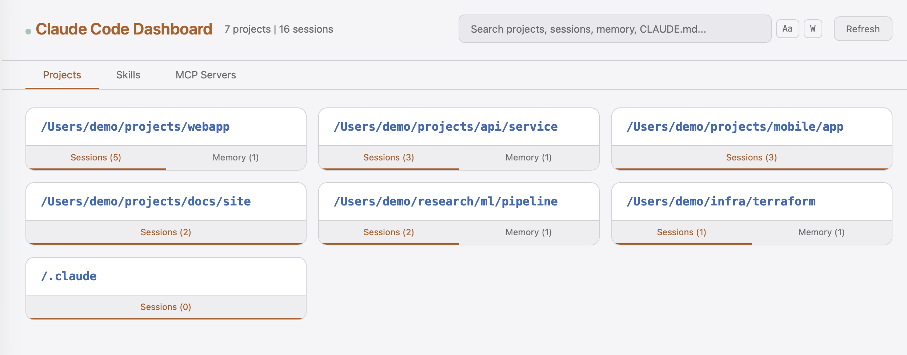
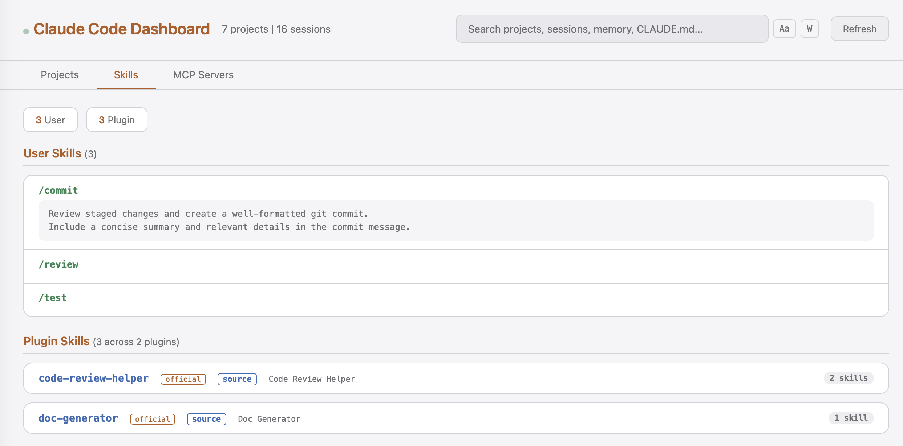
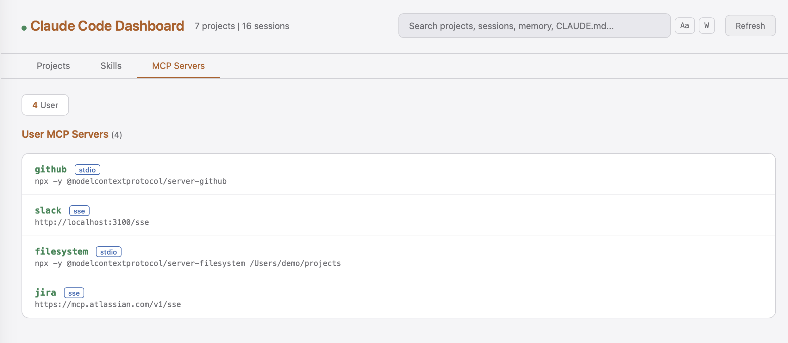

# Claude Code Dashboard

[](https://github.com/jameswnl/claude-dashboard/actions/workflows/ci.yml)

[](https://opensource.org/licenses/MIT)

A visual dashboard for browsing Claude Code projects, sessions, memory files, CLAUDE.md configs, skills, and MCP servers.

Scans `~/.claude/projects/` and presents everything in a searchable web UI.





## Features

- Browse all projects with session counts
- Expand projects to see session history and first messages
- View memory files and CLAUDE.md per project
- Browse skills/commands from user, project, and plugin sources
- View MCP server configurations (user-level and per-project, with secrets masked)
- Full-text search with case-sensitive and full-word match options
- Auto-highlights search matches
- Light/dark theme toggle (persists preference)
- Resume any session directly from the dashboard (opens iTerm2 or Terminal)
- Live auto-refresh when files change

## Setup

Requires [uv](https://docs.astral.sh/uv/) and Python 3.10+.

```bash
uv sync
```

## Usage

```bash
uv run claude-dashboard
```

Opens at http://localhost:8420. A new auth token is generated each launch. If you see an "unauthorized" error, clear your browser's cookies for `localhost` or use an incognito window.

Options:

```bash
uv run claude-dashboard --port 9000
uv run claude-dashboard --projects-dir /path/to/projects
```

Or set the env var:

```bash
export CLAUDE_PROJECTS_DIR=/path/to/projects
```

## macOS Menu Bar App

Optionally run as a menu bar app that manages the server:

```bash
uv sync --extra menubar
uv run claude-dashboard-menubar
```

The menu bar icon (`C>_`) lets you start/stop the server and open the dashboard in your browser.

## Tests

```bash
uv run pytest
```

## Security

The dashboard is a **local-only** tool designed for single-user use on your own machine.

- **Binds to `127.0.0.1` only** — not accessible from the network
- **Per-launch auth token** — a random token is generated each time the server starts; all API requests require it
- **Host header validation** — rejects requests with non-localhost Host headers (DNS rebinding protection)
- **Origin validation** — POST requests are checked for valid Origin headers (CSRF protection)
- **Session validation** — the resume endpoint verifies session/project exist in the dataset before acting
- **Secret masking** — MCP server credentials (auth tokens, API keys, cookies) are masked in the UI
- **CI hardened** — all GitHub Actions pinned to commit SHAs, minimal write permissions

## How it works

- Polls `~/.claude/projects/` every 10 minutes for file changes (manual refresh also available)
- Browser auto-updates via polling `/api/data`
- No external dependencies beyond Python stdlib (rumps optional for menu bar)
