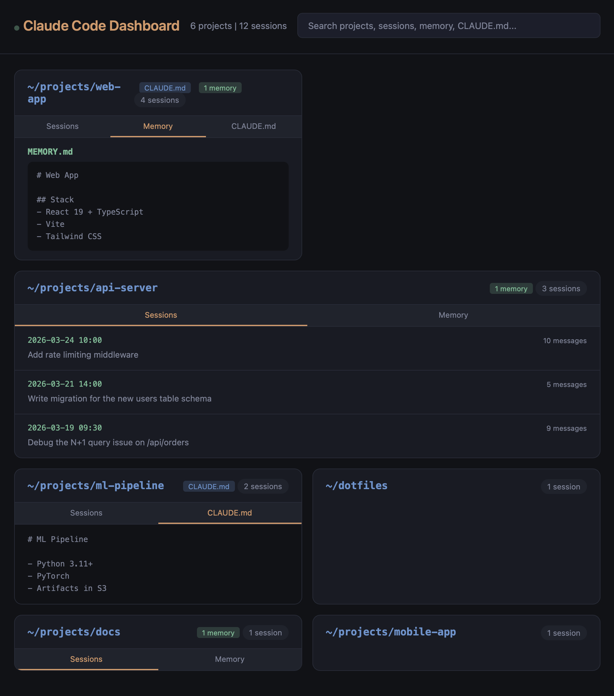

# Claude Code Dashboard

[](https://github.com/jameswnl/claude-dashboard/actions/workflows/ci.yml)

[](https://opensource.org/licenses/MIT)

A visual dashboard for browsing Claude Code projects, sessions, memory files, and CLAUDE.md configs.

Scans `~/.claude/projects/` and presents everything in a searchable web UI.



## Features

- Browse all projects with session counts
- Expand projects to see session history and first messages
- View memory files and CLAUDE.md per project
- Full-text search across project names, session messages, memory, and CLAUDE.md
- Auto-highlights search matches
- Live auto-refresh when files change

## Setup

Requires [uv](https://docs.astral.sh/uv/) and Python 3.10+.

```bash
uv sync
```

## Usage

```bash
uv run claude-dashboard
```

Opens at http://localhost:8420. Options:

```bash
uv run claude-dashboard --port 9000
uv run claude-dashboard --projects-dir /path/to/projects
```

Or set the env var:

```bash
export CLAUDE_PROJECTS_DIR=/path/to/projects
```

## macOS Menu Bar App

Optionally run as a menu bar app that manages the server:

```bash
uv sync --extra menubar
uv run claude-dashboard-menubar
```

The menu bar icon (`C>_`) lets you start/stop the server and open the dashboard in your browser.

## Tests

```bash
uv run pytest
```

## How it works

- Polls `~/.claude/projects/` every 10 minutes for file changes (manual refresh also available)
- Browser auto-updates via polling `/api/data`
- No external dependencies beyond Python stdlib (rumps optional for menu bar)
